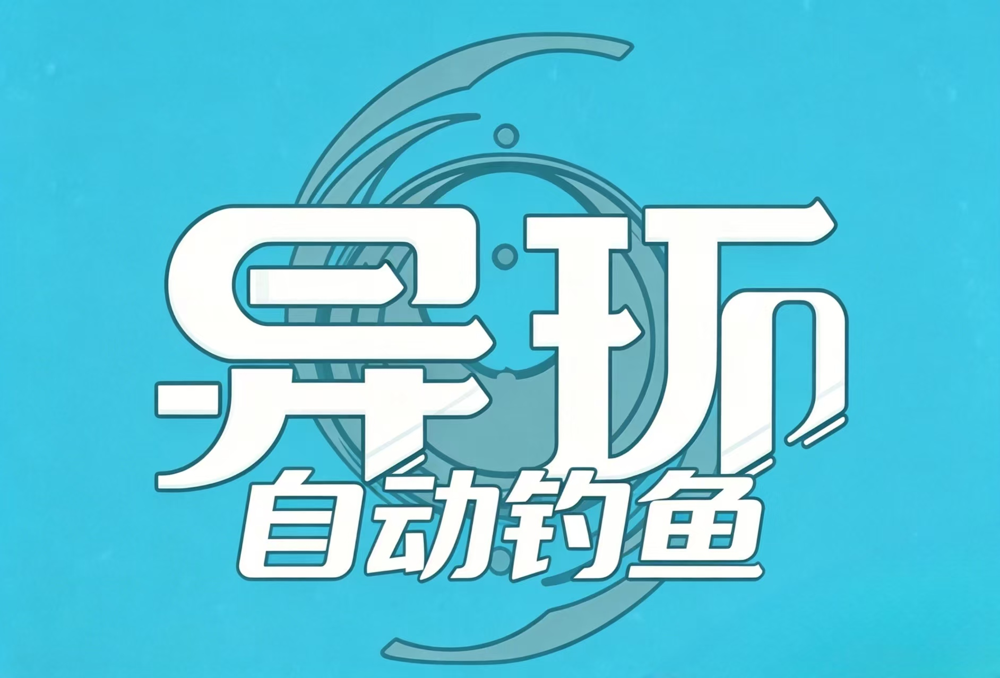

<div align="center">
  

# 异环自动钓鱼 YHo AutoFish

《异环》钓鱼助手：自动抛竿、自动上钩、自动溜鱼、自动记录战绩。

  <p>
    
    
    
    
  </p>

  <p>
    
    
    
  </p>
</div>

## 这是什么

YHo AutoFish 是一个 Windows 桌面钓鱼辅助工具。它通过识别游戏画面中的钓鱼按钮、上钩提示、溜鱼条和结算界面，自动完成一轮又一轮钓鱼，并把钓到的鱼、重量、稀有度和统计数据记录在本地。

它不读取游戏内存，不注入游戏进程，不修改游戏文件。所有判断都来自屏幕画面，所有操作都是普通键盘输入。

> 使用自动化工具可能违反游戏或平台规则。请只在你能承担后果的前提下使用，禁止用于商业代练、破坏公平体验、账号交易或任何侵权用途。

## 适合谁

- 想减少重复钓鱼操作的玩家。
- 想整理鱼类图鉴、捕获记录和战绩统计的玩家。
- 想观察自动钓鱼识别过程、调试不同画面环境的用户。
- 想基于屏幕识别学习桌面自动化的开发者。

## 功能亮点

| 功能   | 说明                         |
| ---- | -------------------------- |
| 自动抛竿 | 识别右下角 `F` 钓鱼提示后自动抛竿        |
| 自动上钩 | 识别上钩文字提示后快速按下 `F`          |
| 自动溜鱼 | 根据绿色目标条和黄色游标自动控制 `A` / `D` |
| 捕获记录 | 自动保存鱼名、重量、时间、稀有度           |
| 图鉴系统 | 支持鱼类资源预览、解锁状态、稀有度筛选        |
| 数据看板 | 显示累计捕获、成功率、最大重量、运行时长       |
| 图表统计 | 支持柱状图、扇形图、趋势图              |
| 悬浮控制 | 游戏旁显示轻量控制窗，方便开始/停止         |
| 调试画面 | 可查看溜鱼识别区域，定位识别问题           |

## 下载与启动

推荐使用发布包，不需要自己配置 Python 环境。

1. 下载或解压 `release/YHoAutoFish-windows.zip`。
2. 打开《异环》，进入可以钓鱼的位置。
3. 运行 `YHoAutoFish.exe`。
4. 首次打开时阅读并确认提示。
5. 点击开始按钮，等待初始化完成后即可自动钓鱼。

如果游戏是管理员权限运行，本工具也需要用管理员权限运行，否则键盘输入可能无法送进游戏。

## 使用前准备

- 系统：Windows 10 或 Windows 11。
- 游戏窗口：保持《异环》正在运行，窗口不要最小化。
- 推荐显示模式：窗口化或无边框窗口化。
- 钓鱼位置：角色站到钓鱼点，右下角能看到 `F` 交互提示。
- 运行中尽量不要遮挡游戏窗口，尤其是上方溜鱼条和结算界面。

## 使用方法

1. 先进入游戏钓鱼点。
2. 打开 YHo AutoFish。
3. 点击“开始钓鱼”。
4. 工具会自动寻找游戏窗口并切到前台。
5. 自动钓鱼过程中可以在“运行日志”查看当前状态。
6. 想暂停时点击“停止”，工具会释放已按下的按键。

焦点丢失时，工具会停止发送按键并释放当前按键，避免误操作其他窗口。

## 界面说明

- 钓鱼记录：查看捕获历史、筛选鱼类、查看图表统计。
- 图鉴记录：按稀有度浏览鱼类，查看已解锁和未解锁状态。
- 运行日志：查看自动钓鱼步骤、错误提示和调试画面。
- 高级设置：调整跟鱼力度、死区、超时、日志保留和调试显示。
- 悬浮窗：在游戏附近显示开始/停止按钮和当前状态。

## 设置建议

大多数情况下使用默认设置即可。只有识别不稳定或操作不顺时再调整。

| 情况            | 建议          |
| ------------- | ----------- |
| 黄色游标左右抖动明显    | 适当调高“跟鱼死区”  |
| 目标条移动快，跟不上    | 适当调高“跟鱼力度”  |
| 画面卡顿导致耐力条偶尔丢失 | 调高“耐力条丢失容忍” |
| 抛竿后太快进入下一步    | 调高“抛竿动画等待”  |
| 结算界面还没关闭就继续判断 | 调高“结算关闭等待”  |
| 想看识别是否准确      | 打开“调试溜鱼视图”  |

## 数据保存在哪里

工具会在程序目录生成 `records.json`，用于保存你的本地钓鱼记录和图鉴解锁状态。

发布包不会内置作者的测试记录。首次启动时如果没有记录文件，会自动创建空记录。

你可以备份 `records.json` 来保留自己的战绩。删除它会重置捕获记录和图鉴进度。

## 常见问题

| 问题         | 解决办法                          |
| ---------- | ----------------------------- |
| 找不到游戏窗口    | 先启动游戏，确认窗口可见且进程为 `HTGame.exe` |
| 按键没有反应     | 确认工具和游戏权限一致，必要时用管理员权限启动工具     |
| 不会自动抛竿     | 确认角色站在钓鱼点，右下角有 `F` 钓鱼提示       |
| 上钩后没反应     | 保持游戏窗口前台，避免遮挡屏幕中央提示           |
| 溜鱼失败率高     | 调整跟鱼力度/死区，并保持稳定帧率             |
| 记录里鱼名或重量不准 | 结算界面可能被遮挡或 OCR 识别不稳定，可查看运行日志  |
| 首次启动比较慢    | 识别模块需要初始化，属于正常现象              |
| 悬浮窗位置不对    | 重新聚焦游戏窗口，或关闭后重新打开悬浮窗          |

## 使用建议

- 开始前先手动确认游戏画面清晰、UI 比例正常。
- 不建议在频繁切屏、多窗口遮挡、低帧率环境下长时间运行。
- 如果识别异常，优先查看“运行日志”和“调试溜鱼视图”。
- 长时间运行前，先短时间测试几轮，确认当前画面和设置稳定。

## 开发者构建

普通用户不需要构建。需要自行打包时，在已安装依赖的环境中运行：

```powershell
powershell -NoProfile -ExecutionPolicy Bypass -File .\build_release.ps1
```

构建完成后会生成 `release/YHoAutoFish-windows.zip`。

## 授权许可

本项目采用自定义限制性许可证：[LICENSE](LICENSE)。

你可以将本项目用于个人学习、研究、查看源码和本地非商业使用。但未经作者事先书面许可，禁止任何形式的商用、二次修改、分发、打包发布、转载、镜像、改名发布、去除署名或基于本项目制作衍生版本。

简单来说：可以个人使用和学习，不可以未经允许拿去赚钱、改版、二次发布或冒充原创。

## 说明

- 本项目仅基于屏幕识别和键盘输入工作。
- 不包含内存修改、封包修改、注入、驱动或隐藏规避行为。
- 项目作者信息见应用内侧边栏；作者为 `FADEDTUMI`。

